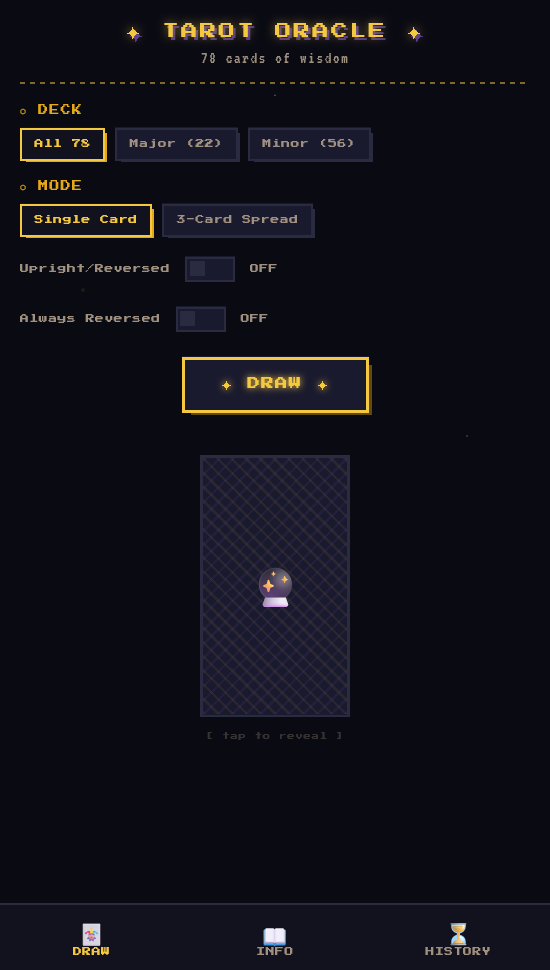
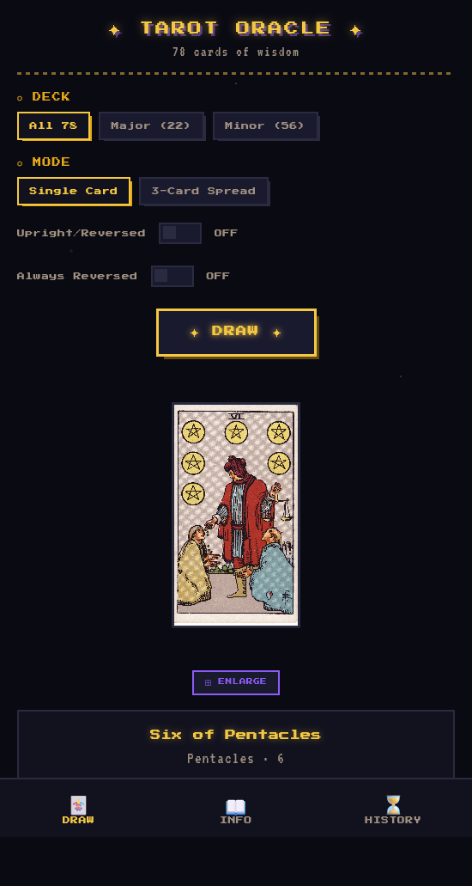
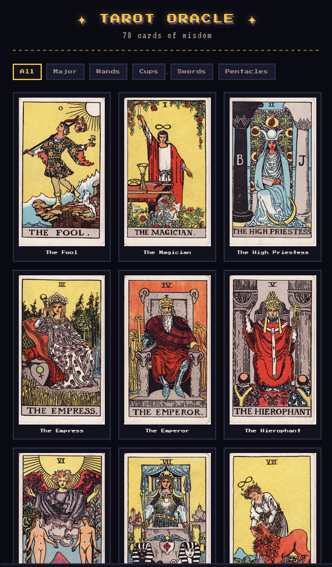
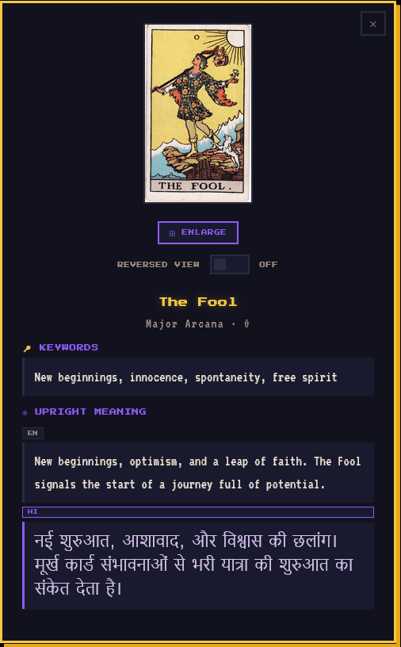
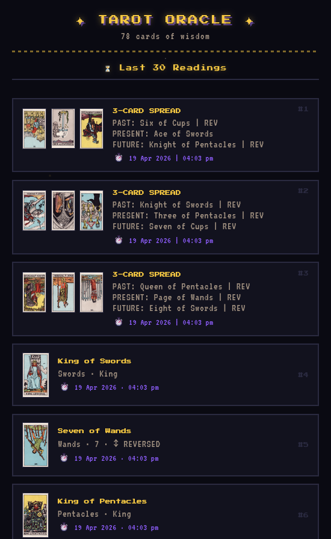
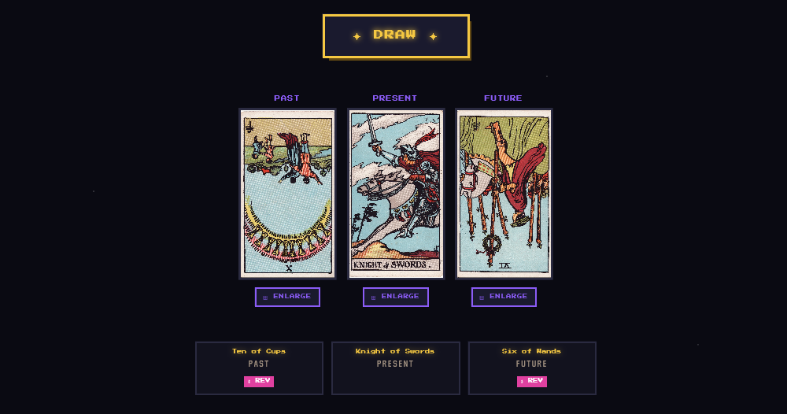

# ♦️ Tarot Oracle

**Tarot Oracle** is a lightweight pixel-style tarot reading app that lets you **draw single cards or 3-card spreads, explore meanings, enlarge card art, and revisit your reading history**.

---

## ✨ Features

- 🃏 **Card Draw** — Pull a random tarot card and explore its meaning.
- 📖 **Card Library** — Browse all 78 tarot cards with detailed descriptions and artwork.
- 🔮 **3-Card Spreads** — Draw past, present, and future spreads for deeper readings.
- 🕰 **Reading History** — Revisit your past draws and reflect on previous readings.
- 🎨 **Pixel Art Style** — Unique retro pixel aesthetic for an immersive experience.
- 📱 **Install as App** — Works offline as a PWA, installable on Android and desktop.

---

## 📸 Screenshots

  
  
  
  
  

  

---

## 🛠 Installation
You can **either download the ready-to-use `.apk`** from [Releases](../../releases) or use the live web app.

### Option 1 — Install Android APK
1. Go to the [Releases](../../releases) page.
2. Download the latest `TarotOracle-v1.0.apk`.
3. Enable **Install unknown apps** in your Android settings if prompted.
4. Tap the downloaded APK to install.

> **Note:** The app is unsigned, so Android may show a security warning — this is normal for sideloaded apps.

### Option 2 — Use as Web App (PWA)
1. Visit [tarotoracle.vercel.app](https://tarotoracle.vercel.app).
2. Tap **Add to Home Screen** in your browser menu.
3. Launch it like a native app — works offline too.

---

## 🧰 Tech Stack

| Technology       | Purpose                                      |
| ---------------- | -------------------------------------------- |
| **HTML/CSS/JS**  | Core frontend — no frameworks                |
| **Web App Manifest** | Enables PWA installability              |
| **Service Worker** | Offline support and caching               |
| **Vercel**       | Hosting and deployment                       |

## 📜 License
This project is licensed under the **GNU General Public License, version 3** — see the [LICENSE](LICENSE) file for details.

## 📨 Feedback & Contributions
Found a bug? [Open an issue](../../issues)
Have an idea? [Create a feature request!](../../issues/new)
Pull requests are welcome ❤️
